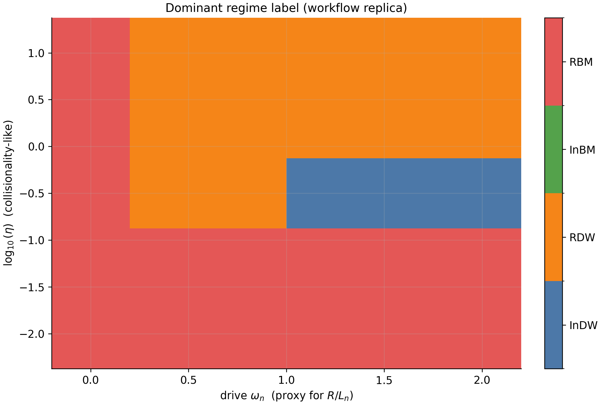

# jaxdrb

`jaxdrb` is a small, CPU-friendly JAX package for linear (flux-tube / field-line) stability analysis of
cold-ion, drift-reduced Braginskii-like edge/SOL models.

## Preview (generated by built-in examples)




## Install (editable)

From this folder:

```bash
python -m pip install -e .
```

If you are offline (or have restricted network access), add:

```bash
python -m pip install -e . --no-build-isolation
```

For dev tools (pytest/ruff/black):

```bash
python -m pip install -e ".[dev]"
```

For docs tooling:

```bash
python -m pip install -e ".[docs]"
mkdocs serve
```

For optional stellarator/VMEC geometry pipelines (ESSOS):

```bash
python -m pip install -e ".[essos]"
```

## CLI

Example ky scan in a shear-slab geometry:

```bash
jaxdrb-scan --geom slab --ky-min 0.05 --ky-max 1.0 --nky 32 --out out_slab
```

Electromagnetic example (adds `psi ~ A_parallel`):

```bash
jaxdrb-scan --model em --geom slab --beta 0.1 --ky-min 0.05 --ky-max 1.0 --nky 32 --out out_em
```

Hot-ion example (adds `Ti`):

```bash
jaxdrb-scan --model hot-ion-es --geom slab --tau-i 1.0 --omega-Ti 0.8 --ky-min 0.05 --ky-max 1.0 --nky 32 --out out_hot
```

2D eigenvalue scan over `(kx, ky)`:

```bash
jaxdrb-scan2d --geom salpha --kx-min -1.0 --kx-max 1.0 --nkx 33 --ky-min 0.1 --ky-max 1.0 --nky 24 --out out_kxky
```

Circular tokamak:

```bash
jaxdrb-scan --geom tokamak --ky-min 0.05 --ky-max 1.0 --nky 32 --out out_tok
```

Cyclone-like s-alpha:

```bash
jaxdrb-scan --geom salpha --q 1.4 --shat 0.796 --epsilon 0.18 --alpha 0.0 --ky-min 0.05 --ky-max 1.0 --nky 32 --out out_cyclone
```

Tabulated geometry:

```bash
jaxdrb-scan --geom tabulated --geom-file mygeom.npz --ky-min 0.05 --ky-max 1.0 --nky 32 --out out_tab
```

Nonlinear milestone (2D periodic HW-like drift-wave turbulence):

```bash
jaxdrb-hw2d --nx 96 --ny 96 --tmax 40 --dt 0.05 --out out_hw2d_cli
```

Nonlinear + neutrals (minimal particle exchange model):

```bash
jaxdrb-hw2d --neutrals --nu-ion 2.0 --nu-rec 0.2 --out out_hw2d_neutrals_cli
```

## Status

This implementation is aimed at fast iteration:
- Fourier representation in perpendicular directions: `exp(i kx psi + i ky alpha)`
- 1D grid along the field line (`l`)
- Polarization closure in Fourier form (Boussinesq by default; optional linearized non-Boussinesq)
- Model variants: cold-ion electrostatic, hot-ion electrostatic (adds `Ti`), electromagnetic (adds `psi`)

Nonlinear support is evolving. The first nonlinear milestone is a 2D periodic drift-wave testbed
(`jaxdrb.nonlinear.hw2d`) used to validate and benchmark core operators (brackets, FFT Poisson solves,
dealiasing, time stepping) and to host optional additional physics (e.g. neutrals) in a togglable way.

## Examples (including literature workflows)

The `examples/` tree is organized by complexity:

- `examples/1_simple/`: quick “hello world” ky scans + diagnostics
- `examples/2_intermediate/`: tabulated-geometry round-trip, kx–ky scans, JAX autodiff workflow
- `examples/3_advanced/`: literature-inspired workflows + stellarator (ESSOS) geometry

Quick smoke test (runs the simple examples):

```bash
make examples
```

Run everything (advanced examples may take a while):

```bash
make examples-all
```

Near-axis stellarator example (requires ESSOS):

```bash
make examples-stellarator
```

ISTTOK-inspired linear workflow (Jorge et al. 2016):

```bash
python examples/3_advanced/05_jorge2016_isttok_linear_workflow.py
```

## Docs

Build locally:

```bash
python -m pip install -e ".[docs]"
mkdocs serve
```
