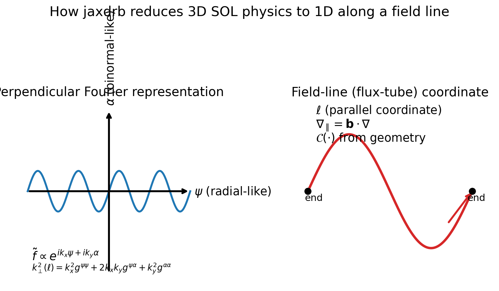
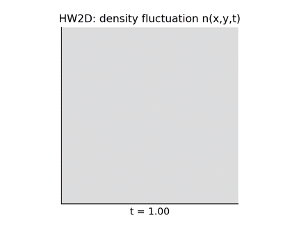

# jaxdrb

`jaxdrb` is a JAX-native research code for **drift-reduced Braginskii (DRB)** physics in the tokamak edge and scrape-off layer (SOL).
It focuses on **fast linear stability workflows** along a magnetic field line (flux-tube / ballooning representation), and uses smaller
nonlinear/verification milestones to make the numerics reviewer-checkable and end-to-end differentiable.



## What this repository contains

**Core capability: linear stability along a field line**

- Computes growth rates/frequencies for drift waves and ballooning-like modes.
- Solves the linearized system via:
  - initial-value time evolution (growth-rate estimation),
  - matrix-free Arnoldi eigenvalue solves (Ritz spectrum) with `J·v` from `jax.linearize`.

**Geometry is pluggable**

- Analytic slab and **s–α** (tokamak ballooning) benchmarks.
- Circular tokamak geometry (analytic).
- Tabulated geometry from `.npz` (drop-in replacement).
- Optional ESSOS-driven geometries (VMEC / near-axis / Biot–Savart).
- A preparation milestone for **FCI (flux-coordinate independent)** operators (for X-points / islands): see `docs/fci/`.

**Physics knobs / extensions**

- Cold-ion electrostatic DRB (baseline).
- Hot-ion electrostatic variant (adds `Ti`).
- Electromagnetic extension (adds `psi ~ -A_parallel`).
- Boussinesq and linearized non-Boussinesq polarization closures.
- Open-field-line MPSE/sheath entrance closures (Bohm/Loizu-style), plus optional sheath heat/SEE knobs.
  - The Loizu2012 “full set” includes a matching hot-ion endpoint constraint `∂_|| Ti = 0` when using the hot-ion model.
- Equilibrium-based Braginskii/Spitzer scalings for transport coefficients (optional).

## Literature-aligned plots (generated by examples)

**Ideal-ballooning / s–α map (Halpern et al. 2013-style workflow)**  
`examples/06_literature_tokamak_sol/halpern2013_salpha_ideal_ballooning_map.py`


**SOL-width proxy workflow (ISTTOK / Jorge et al. 2016-style)**  
`examples/06_literature_tokamak_sol/jorge2016_isttok_linear_workflow.py`


**Instability regime map (Mosetto et al. 2012-style workflow)**  
`examples/06_literature_tokamak_sol/mosetto2012_regime_map.py`


**Full MPSE/sheath boundary condition set (Loizu 2012, hot-ion model)**  
`examples/03_sheath_mpse/loizu2012_full_hot_ion_mpse_bc.py`

## A nonlinear milestone (HW2D turbulence) + movie

`jaxdrb` includes a fast 2D Hasegawa–Wakatani-like nonlinear testbed used to validate conservative advection kernels,
Poisson solves, time stepping, and differentiability through nonlinear evolution.



## Quickstart

Install editable:

```bash
python -m pip install -e .
```

Run a small linear scan (slab geometry):

```bash
jaxdrb-scan --geom slab --ky-min 0.05 --ky-max 1.0 --nky 32 --out out_slab
```

Run a Cyclone-like s–α scan (tokamak ballooning benchmark):

```bash
jaxdrb-scan --geom salpha --q 1.4 --shat 0.796 --epsilon 0.18 --alpha 0.0 --ky-min 0.05 --ky-max 1.0 --nky 32 --out out_cyclone
```

Make a short nonlinear movie (GIF):

```bash
python examples/08_nonlinear_hw2d/hw2d_movie.py --out out_hw2d_movie
```

## Model at a glance (linear flux-tube form)

The baseline DRB model evolves (in normalized units) the fields:

- `y = (n, Omega, vpar_e, vpar_i, Te)`

and obtains the electrostatic potential from a polarization closure.

In the flux-tube / ballooning representation, perturbations are taken as:

- `f~(psi, alpha, l, t) = f^(l,t) * exp(i*kx*psi + i*ky*alpha)`

so perpendicular operators reduce to geometry-provided coefficients such as `k_perp^2(l)`. In the Boussinesq limit:

- `Omega(l) = -k_perp^2(l) * phi(l)`

The geometry provider supplies (at minimum) `k_perp^2(l)`, the parallel derivative `∇_|| = b·∇`, and a curvature operator `C(·)`.

Rendered equations and normalization details: `docs/model/equations.md` and `docs/model/normalization.md`.

## What “s–α geometry” means (and why it’s useful)

In tokamak ballooning theory, the s–α model captures how:

- **magnetic shear** `shat = (r/q) dq/dr` tilts field lines and tends to stabilize ballooning structure,
- the **ballooning parameter** `alpha` (proportional to the pressure gradient) drives ideal ballooning instability.

In `jaxdrb`, `--geom salpha` lets you scan $\gamma(k_y)$ and map $\gamma(\hat{s},\alpha)$ using the same solver workflow you use for other geometries.

## Why JAX (and what it enables here)

`jaxdrb` uses JAX as the array engine so that:

- matrix-free linearization (`J·v`) uses automatic differentiation (`jax.linearize` / `jax.jvp`),
- scans over $(k_x,k_y)$ and parameter knobs can be vectorized (`vmap`) and compiled (`jit`),
- parts of the workflow remain **end-to-end differentiable**, enabling gradient-based studies.

Example: optimizing a proxy “most unstable” $k_y$ with autodiff:

```bash
python examples/05_jax_autodiff/autodiff_optimize_ky_star.py
```

## Relationship to other edge/SOL codes

Codes such as **GBS/GDB**, **BOUT++**, **Hermes-3**, and **GRILLIX** target large-scale nonlinear SOL turbulence simulations
in increasingly realistic diverted geometries.

`jaxdrb` is complementary:

- it emphasizes **fast linear workflows**, rapid geometry swapping, and *differentiable* matrix-free solvers,
- it includes verification milestones (HW2D, FCI operator tests, Poisson solver tests) to keep the numerics auditable,
- it is designed to be easy to read and modify for targeted studies, method development, and solver experimentation.

## Verification, validation, and performance

- Verification and benchmark scripts live in `examples/10_verification/`.
- The documentation has a dedicated validation page with references and reproduced figures: `docs/validation.md`.
- A micro-benchmark for HW2D stepping lives in `benchmarks/bench_hw2d_step.py`.

## Documentation

Online docs (Read the Docs): https://jax-drb.readthedocs.io/

Build locally:

```bash
python -m pip install -e ".[docs]"
mkdocs serve
```

## Install options (extras)

```bash
python -m pip install -e ".[dev]"    # ruff/black/pytest
python -m pip install -e ".[docs]"   # mkdocs + mkdocstrings
python -m pip install -e ".[essos]"  # ESSOS geometry workflows (VMEC/near-axis/Biot-Savart)
```

## Development

Run tests and formatting:

```bash
make test
make lint
```
