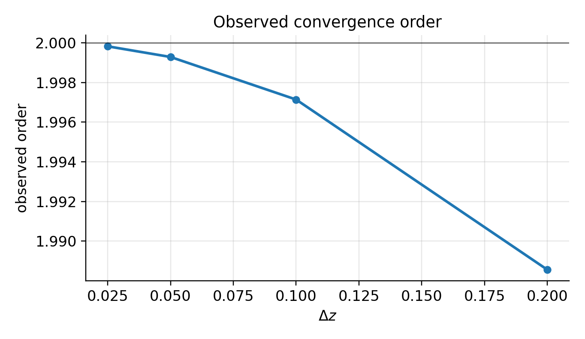

# Flux-coordinate independent (FCI) approach

This page describes the components needed to support a **flux-coordinate independent (FCI)** discretization
in `jaxdrb`, targeting nonlinear SOL simulations in geometries with **X-points** and **magnetic islands**
(including island divertors).

FCI is a widely used strategy in modern edge/SOL turbulence codes because it avoids flux-surface coordinates
in the perpendicular plane, while still exploiting strong parallel anisotropy.

## References (in `drb_literature/fci_approach/`)

- F. Hariri et al. (2014), *The flux-coordinate independent approach applied to X-point geometries*,
  Physics of Plasmas 21, 082509. DOI: [`10.1063/1.4892405`](https://doi.org/10.1063/1.4892405).
- A. Stegmeir et al. (2018), *GRILLIX: a 3D turbulence code based on the flux-coordinate independent approach*,
  Plasma Phys. Control. Fusion 60, 035005. DOI: [`10.1088/1361-6587/aaa373`](https://doi.org/10.1088/1361-6587/aaa373).

## Core idea (field-line maps)

FCI represents fields on a set of **perpendicular planes** (e.g. poloidal planes in $(R,Z)$ at discrete toroidal
angles $\varphi_k$). Perpendicular operators remain in-plane and can use standard methods (FD/FV/DG).

Parallel derivatives are constructed by:

1. tracing the magnetic field line from a grid point on plane $k$ to the next/previous plane,
2. interpolating the field values at the mapped footpoints on planes $k\pm1$,
3. applying a finite difference along the field line.

In its simplest centered form:

$$
\partial_\parallel f \big|_k \;\approx\; \frac{f_{k+1}(x^+,y^+) - f_{k-1}(x^-,y^-)}{2\,\Delta l},
$$

where $(x^\pm,y^\pm)$ are the mapped footpoints and $\Delta l$ is the distance along the field line between planes.

## What is needed in `jaxdrb` to support diverted tokamaks and island divertors

### 1) A geometry + field-line tracing pipeline

We need a *geometry provider* that can:

- evaluate $\\mathbf{B}(\\mathbf{x})$ and (optionally) metric/Jacobian factors needed by the model,
- trace field lines between planes robustly (including near X-points and close to material boundaries),
- detect intersections with limiter/divertor plates and return target information.

In practice, most FCI codes precompute a **field-line map** (and interpolation weights) offline and load it at runtime.

### 2) A map data structure + interpolation

At runtime we need a compact, differentiable representation of the map:

- indices and weights for in-plane interpolation at the forward/backward footpoints,
- a representation of variable $\\Delta l(\\mathbf{x})$,
- masks for points whose field line hits a boundary (open field lines).

The current scaffold lives in:

- `src/jaxdrb/fci/map.py`
- `src/jaxdrb/fci/parallel.py`

### 3) Parallel boundary conditions (sheath / target plates)

For SOL physics, many field lines are open and end on targets:

- parallel derivatives become one-sided near the target,
- sheath boundary conditions (e.g. Bohm entrance and heat transmission) impose nonlinear closures,
- the map needs to carry “distance-to-target” and target-normal information for sheath/source terms.

These boundary interactions are central for quantitative SOL predictions and will be a major nonlinear milestone.

### 4) Conservative, stable numerics in JAX

To remain reviewer-proof and performant, the nonlinear discretization should:

- preserve quadratic invariants in the appropriate limits (Arakawa/SBP/DG-style conservative kernels),
- handle stiffness with IMEX or semi-implicit methods (matrix-free Krylov solvers in JAX),
- remain end-to-end differentiable for inverse problems and sensitivity studies.

## What we can build and validate early (key ingredients)

Some components take time to harden and should be started early:

1. **FCI parallel derivative operators + MMS tests** (independent of the plasma model).
2. **Map validation tools**: compare interpolation against known analytic maps (slab), and check consistency properties.
3. **Poisson/polarization solvers with non-periodic BCs**: robust, differentiable elliptic solvers are critical once
   the domain is no longer periodic (targets, walls).

These are the first pieces being added now.

## Example

The slab MMS-style FCI convergence script:

- `examples/09_fci/fci_slab_parallel_derivative_mms.py`

generates a convergence plot for the centered FCI parallel derivative using an analytic constant-$B$ map.

