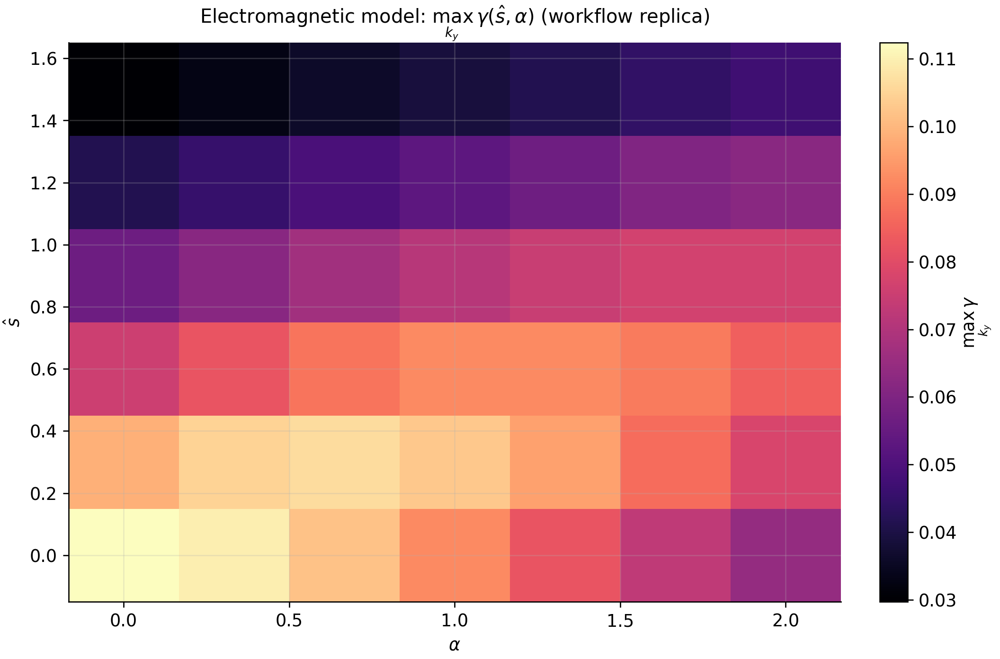

# jaxdrb

`jaxdrb` is a JAX-based linear stability tool for cold-ion, drift-reduced Braginskii-like edge/SOL
models in a **flux-tube / field-line** representation. The goal is to quickly compute unstable
modes (drift-wave-like and ballooning-like branches; resistive and inertial behavior) across
different geometries while keeping the model core independent of the geometry source.

This documentation includes:

- conceptual overview and getting started material,
- CLI usage and example workflows,
- detailed equations, algorithms, and implementation notes.

## What is implemented

### Representation

We work in a field-line coordinate `l` (often `theta`) and assume perpendicular Fourier structure:

$$
\tilde{f}(\psi,\alpha,l,t) = \hat{f}(l,t)\,\exp\{ i k_x \psi + i k_y \alpha \}.
$$

This reduces all perpendicular operators to **algebraic coefficients** varying along `l`:

$$
\nabla_\perp^2 \hat{f} = -k_\perp^2(l)\,\hat{f}.
$$

### Baseline fields (cold-ion electrostatic)

The state is a 5-field vector (all functions of `l`):

$$
Y = \bigl(n,\ \Omega,\ v_{\parallel e},\ v_{\parallel i},\ T_e\bigr).
$$

The electrostatic potential is obtained from a Boussinesq polarization closure:

$$
\Omega = -k_\perp^2(l)\,\phi
\quad\Rightarrow\quad
\phi = -\frac{\Omega}{k_\perp^2(l)}.
$$

`jaxdrb` also includes model variants that add:

- **hot ions** (adds an ion-temperature field `Ti` and ion-pressure couplings),
- **electromagnetic induction** (adds an inductive field `psi ~ A_parallel` and an Ampère closure),
- **non-Boussinesq polarization** linearized about an equilibrium $n_0(l)$.

See: `model/extensions.md`.

### Geometry abstraction

The geometry is an object that provides:

- `kperp2(kx, ky)` → $k_\perp^2(l)$ (metric information),
- `dpar(f)` → $\nabla_\parallel f$ along the field line,
- `curvature(kx, ky, f)` → a linear curvature operator $C(f)$.

This means you can swap geometry providers without modifying the model core.

### Linearization strategies

`jaxdrb` supports both:

1. **Initial-value** growth-rate estimation by time-advancing
   $$\frac{d}{dt}\,\delta Y = J\,\delta Y$$
   using Diffrax and extracting $\gamma$ from the log-norm slope (in a numerically robust
   renormalized formulation).
2. **Eigenvalue** estimation with a matrix-free Arnoldi method using only `matvec(v)=J·v`.

## Quick links

- Getting started: `getting-started.md`
- Inputs & outputs: `inputs-outputs.md`
- Model equations: `model/equations.md`
- Geometry interface and built-ins: `geometry/index.md`
- Solvers: `solvers/index.md`
- CLI reference: `cli.md`
- Examples: `examples.md`
- Development and contributing: `development.md`

## Gallery (from built-in examples)

These figures are generated by scripts in `examples/3_advanced/` and are included here as a quick
preview of the workflows `jaxdrb` supports.

