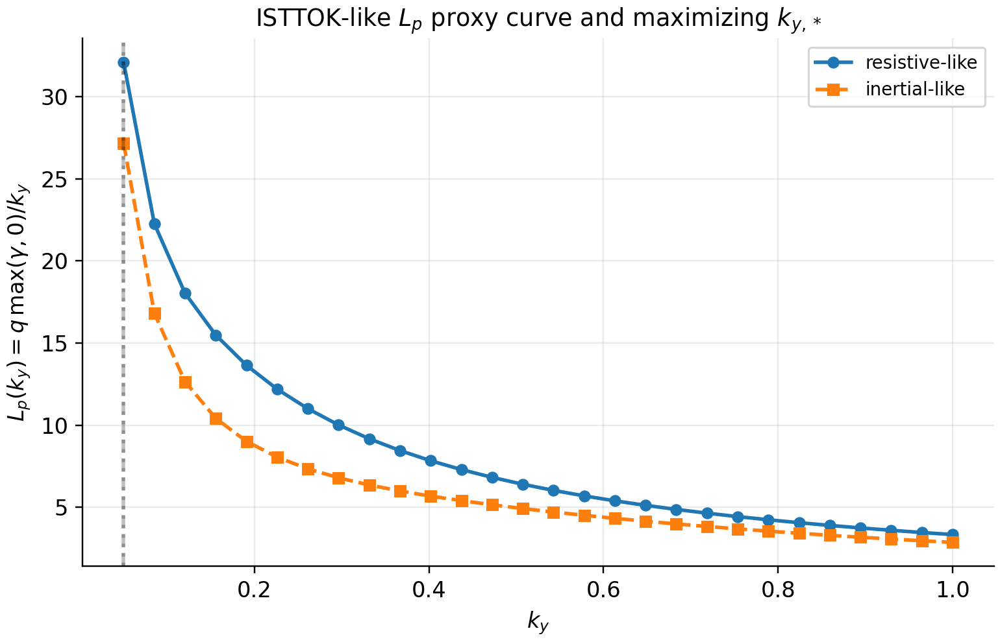

# Jorge et al. (2016): ISTTOK SOL turbulence context (linear workflows)

Jorge et al. study SOL turbulence in the ISTTOK tokamak:

- R. Jorge, P. Ricci, F. D. Halpern, N. F. Loureiro, and C. Silva,
  *Plasma turbulence in the scrape-off layer of the ISTTOK tokamak*,
  **Physics of Plasmas 23**, 102511 (2016). DOI: 10.1063/1.4964783.

Their paper is primarily nonlinear and includes SOL-specific physics (sources, sheath boundary
conditions, open-field-line connection), but it also motivates and uses linear-mode analysis to
identify driving instabilities and parameter trends.

`jaxdrb` does **not** implement full sheath boundary conditions or sources, so it cannot reproduce
the nonlinear ISTTOK results quantitatively. What it *can* do is reproduce the local linear analysis
workflow on an **ISTTOK-like large-aspect-ratio geometry** (circular tokamak with parameters drawn
from the paper) and explore how growth rates and branch structure vary with model parameters.

## ISTTOK-like geometry parameters

From Jorge et al. (2016), the normalized machine parameters (in $\rho_{s0}$ units) imply:

- major-radius scale $R \approx 504\,\rho_{s0}$,
- minor-radius scale $a \approx 93\,\rho_{s0}$,
- safety factor $q \approx 8$,
- large-aspect-ratio inverse aspect ratio $\epsilon \approx a/R \approx 0.18$,
- no magnetic shear (in the simplified geometry discussion).

In `jaxdrb`, we map these into the analytic circular tokamak model:

- `q = 8`
- `epsilon ≈ 0.18`
- `shat = 0`
- `curvature0 ≈ epsilon` (curvature amplitude used in the toy geometry)

## Example script

Run:

```bash
python examples/3_advanced/05_jorge2016_isttok_linear_workflow.py
```

This script:

- builds an ISTTOK-like circular tokamak field-line geometry,
- runs $k_y$ scans for a small set of “cases” (varying resistive/inertial parameters),
- plots:
  - $\gamma(k_y)$ and $\omega(k_y)$,
  - the transport proxy $\max(\gamma,0)/k_y$,
  - an $L_p$ proxy curve $L_p(k_y)=q\,\max(\gamma,0)/k_y$ and the maximizing $k_{y,*}$,
  - representative eigenfunction structure at the maximizing point.



## Notes on quantitative comparisons

For quantitative agreement with ISTTOK turbulence regimes, the following missing physics matters:

- sheath boundary conditions at the limiter/divertor plates,
- sources/sinks (recycling, neutrals, heat sources),
- realistic 2D/3D geometry and open-field-line topology,
- electromagnetic effects (where relevant),
- full Braginskii closure terms and collisional transport models.

`jaxdrb`’s purpose here is to provide a transparent, geometry-pluggable *linear* solver that makes
parameter scans and matrix-free eigenvalue computations easy (and differentiable, where desired).
