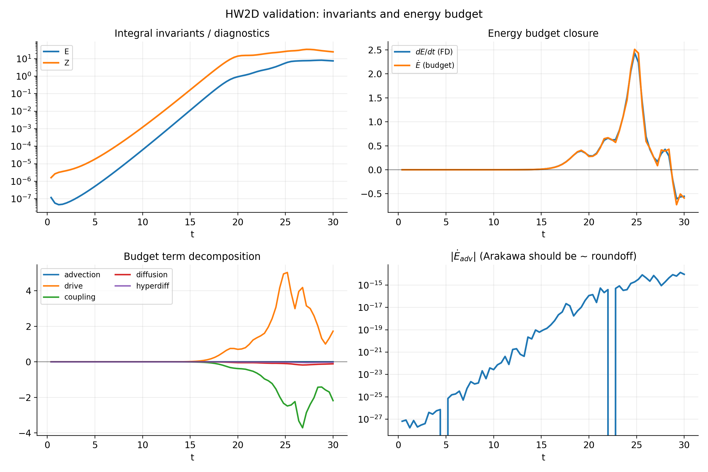
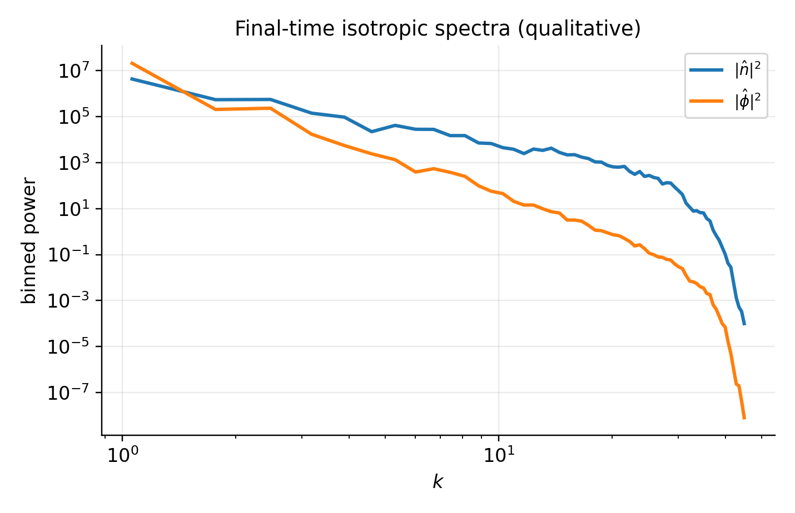
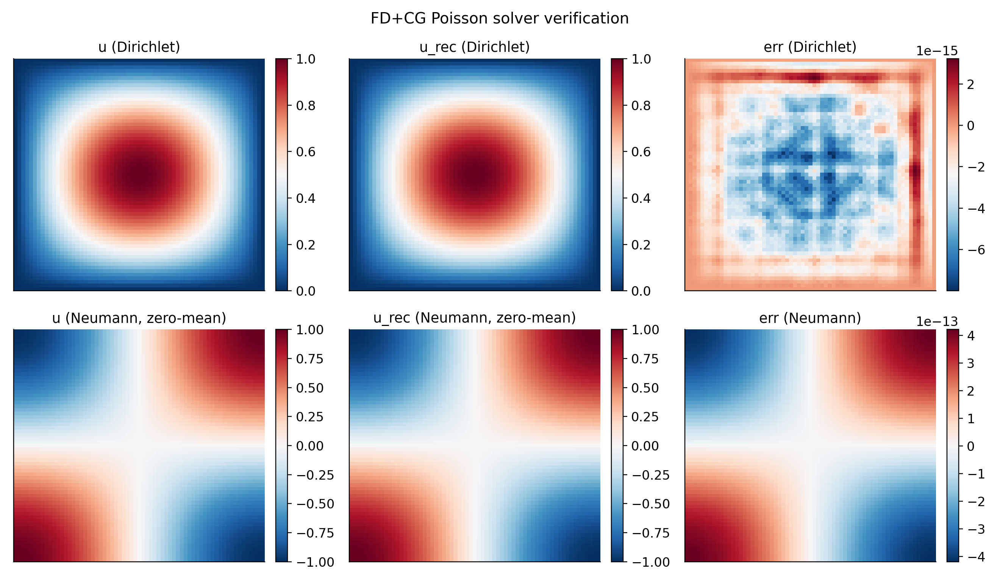

# Validation & benchmarks

This page lists the **numerical** and **physics** checks used in `jaxdrb` to support confident use in research.
The intent is to make it straightforward to answer:

- What was checked?
- Where is it implemented (tests and examples)?
- Which references support the check?

## How to run the checks

- Unit/integration tests: `python -m pytest -q`
- Documentation build: `mkdocs build --strict`
- Selected physics validations (examples): see `examples/` and `docs/examples.md`

## Nonlinear HW2D (Hasegawa–Wakatani) validation

The 2D HW2D model is used as a fast nonlinear testbed for:

- conservative/adaptive time stepping in JAX,
- Poisson solves (polarization closure),
- Poisson brackets / advection kernels,
- end-to-end differentiability through a nonlinear evolution.

Key files:

- Model: `src/jaxdrb/nonlinear/hw2d.py`
- Conservative bracket (Arakawa): `src/jaxdrb/operators/brackets.py`
- Validation tests: `tests/test_hw2d_validation.py`
- Validation example: `examples/08_nonlinear_hw2d/hw2d_camargo1995_validation.py`

### Energy functional and budget closure

For periodic domains with the Boussinesq polarization closure,

$$
\omega = \nabla_\perp^2 \phi,
$$

a standard HW energy functional is:

$$
E = \frac{1}{2}\left\langle n^2 + |\nabla \phi|^2 \right\rangle,
$$

and can be differentiated using the periodic identity

$$
\frac{d}{dt}\left(\frac{1}{2}\langle |\nabla \phi|^2\rangle\right) = -\langle \phi\,\partial_t \omega\rangle,
$$

so that:

$$
\dot E = \left\langle n\,\partial_t n - \phi\,\partial_t \omega \right\rangle.
$$

`jaxdrb` uses this to compute a term-by-term energy budget from the discrete RHS, and compares it to a finite-difference estimate of $dE/dt$.

Reference:

- S. J. Camargo, D. Biskamp, and B. D. Scott, *Resistive drift-wave turbulence*, **Phys. Plasmas** 2(1), 48 (1995). DOI: [`10.1063/1.871116`](https://doi.org/10.1063/1.871116).

Example output:

### Quadratic invariant conservation (ideal subset)

In the ideal subset (no drive, no coupling, no diffusion),

$$
\partial_t n + [\phi,n] = 0,\qquad \partial_t \omega + [\phi,\omega] = 0,
$$

the continuous system conserves quadratic invariants. For reviewer-proof nonlinear runs, `jaxdrb` uses **Arakawa's conservative Jacobian** (Arakawa, 1966) by default on periodic grids, and includes tests that verify invariant conservation over time.

For additional qualitative turbulence diagnostics, the validation example also plots final-time isotropic spectra:

## Method of manufactured solutions (MMS)

MMS tests are included to validate the implementation order and to catch sign/normalization mistakes.

- Example: `examples/08_nonlinear_hw2d/mms_hw2d_convergence.py`
- Tests: see `tests/` for MMS-based checks

## Linear solver checks (matrix-free J·v)

The linear stability solvers are validated by internal consistency checks:

- growth rates from initial-value evolution vs leading eigenvalues from Arnoldi,
- Jacobian–vector products via `jax.linearize` / `jax.jvp` compared against finite-difference sanity checks,
- known qualitative limits in slab/s–alpha geometries.

See:

- Tests: `tests/test_growth_vs_eigs.py`, `tests/test_slab_dispersion.py`
- Solver docs: `docs/solvers/`
- Known limits: `docs/theory/known-limits.md`

## Geometry provider checks

Geometry is validated by:

- consistency checks on tabulated coefficients (shapes, positivity where required),
- reference analytic cases (slab / s–alpha),
- ESSOS-driven field-line workflows (VMEC / near-axis / Biot–Savart).

See:

- Geometry docs: `docs/geometry/`
- Examples: `examples/02_geometry/`, `examples/07_essos_geometries/`

## Elliptic (Poisson/polarization) solver verification

Elliptic solves are a central ingredient for nonlinear evolution (polarization closure).

`jaxdrb` includes:

- a spectral inverse Laplacian for periodic domains (exact up to roundoff),
- a matrix-free conjugate-gradient (CG) FD Poisson solver for Dirichlet/Neumann domains.

Verification tests:

- `tests/test_fd_poisson_cg.py`

Example output (Dirichlet and Neumann cases):

## FCI operator verification (preparation milestone)

Before adopting a full FCI nonlinear SOL model, the *geometry-agnostic* building blocks are validated:

- field-line maps + bilinear interpolation on structured planes,
- centered parallel derivative operator and MMS-style convergence checks.

See:

- Tests: `tests/test_fci_parallel.py`
- Docs: `docs/fci/index.md`
- Example: `examples/09_fci/fci_slab_parallel_derivative_mms.py`
